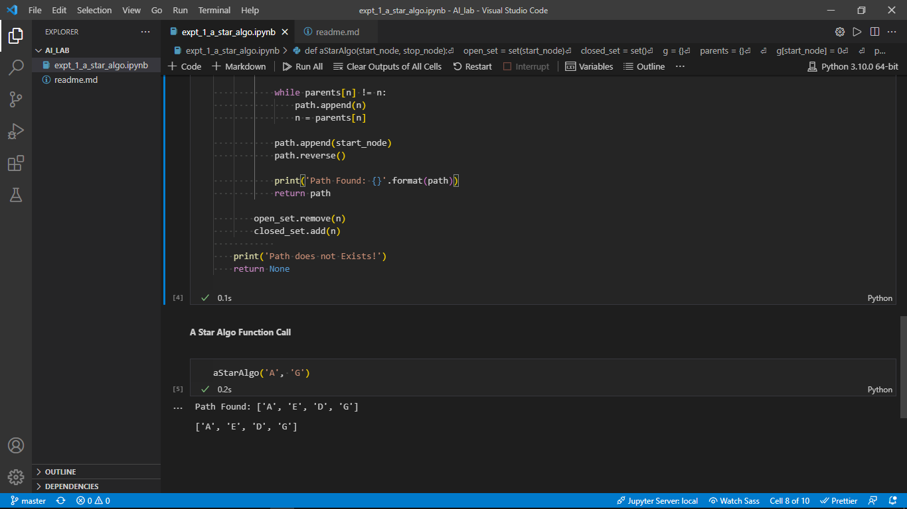
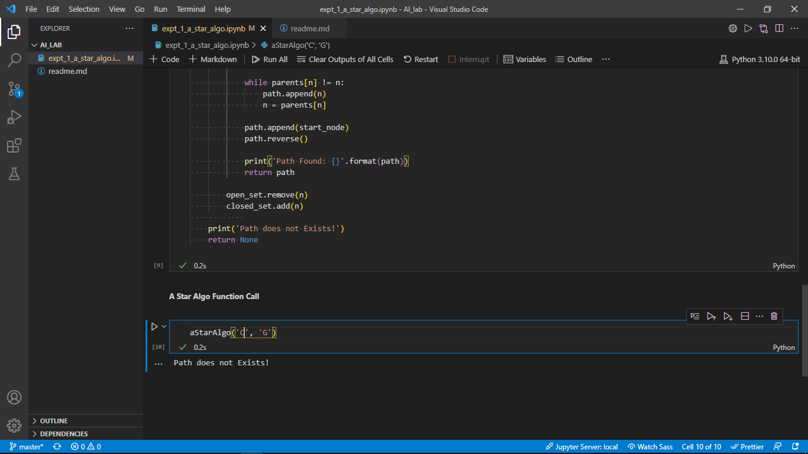
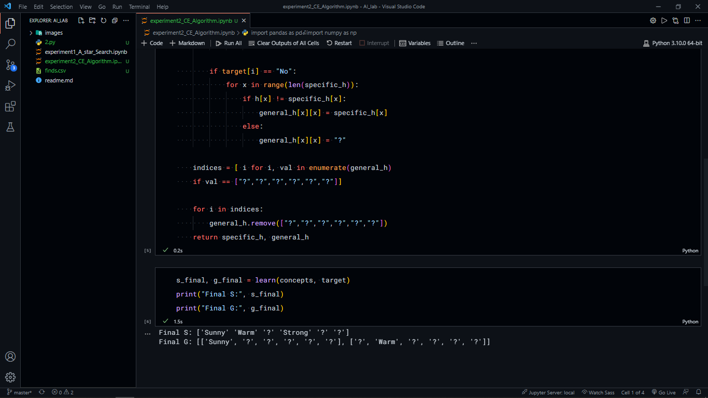

# Artificial Intelligence and Machine Learning laboratory

# Dev Environment instructions

# requirements

- visual studio code / jupyter notebook
- install jupyter notebook extension on vs code
- python extension
- pip
- python 3

## Experiment 1: A* Search Algorithm

A* Algorithm in Python or in general is basically an artificial intelligence problem used for the pathfinding \(from point A to point B\) and the Graph traversals. This algorithm is flexible and can be used in a wide range of contexts.

A* Search algorithm is one of the best and popular technique used in path-finding and graph traversals.

This Algorithm is the advanced form of the BFS algorithm \(Breadth-first search\), which searches for the shorter path first than, the longer paths. It is a complete as well as an **optimal** solution for solving path and grid problems.

**Optimal** – find the least cost from the starting point to the ending point. Complete – It means that it will find all the available paths from start to end.

### Basic concepts of A*

**f\(n\) = g\(n\) + h\(n\)**

Where

- g\(n\) : The actual cost path from the start node to the current node.
- h\( n\) : The actual cost path from the current node to goal node.
- f\(n\) : The actual cost path from the start node to the goal node.

For the implementation of A* algorithm we have to use two arrays namely OPEN and CLOSE.

**OPEN:**

An array that contains the nodes that have been generated but have not been yet examined till yet.

**CLOSE:**

An array which contains the nodes which are examined.

### Algorithm

### Output

## Experiment 2: Candidate Elimination Algorithm

#### Problem Statement

For a given set of training data examples stored in a CSV file, implement and demonstrate that Candidate-Elimination Algorithm to output a description of the set of all hypothesis consistent with the training examples.

#### Task

The Candidate-Elimination algorithm computes the VERSION SPACE containing all hypothesis from H that are consistent with an observed sequence of training examples.

#### Dataset: finds.csv

| Sky     | AirTemp   | Humidity   | Wind     | Water   | Forecast   | EnjoySport   |
| :---    | :---      | :---       | :---     | :---    | :---       | :---         |
| Sunny   | Warm      | Normal     | Strong   | Warm    | same       | Yes          |
| Sunny   | Warm      | High       | Strong   | Warm    | same       | Yes          |
| Rainy   | Cold      | High       | Strong   | Warm    | change     | No           |
| Sunny   | Warm      | High       | Strong   | Warm    | change     | Yes          |

#### Expected Output

`Final S: ['Sunny' 'Warm' '?' 'Strong' '?' '?']
Final G: [['Sunny', '?', '?', '?', '?', '?'], ['?', 'Warm', '?', '?', '?', '?']]`

#### Actual Output screenshot

## Experiment 3: ID3 Algorithm

#### Problem Statement

Write a program to demonstrate the working of the decision tree based ID3 Algorithm. use an appropriate dataset for building the decision tree and apply this knowledge to classify a new sample.

#### Task

ID3 determines the information gain for each candidate attribute the selects the one with highest information gain as the root node of the tree. the information gain values for all the four attributes are calculated using the following formula:
`IG = -{( P / P+N )log2( P / P+N ) + ( N / P+N )log2( N / P+N )}`

entropy: `Entropy(A) = IG(PiNi) * P(A)`

#### Dataset: Weather.csv

| Day | Outlook  | Temperature | Humidity | Wind   | PlayTennis |
| :---| :---     | :---        | :---     | :---   | :---       |
| 1   | Sunny    | Hot         | High     | Weak   | No         |
| 2   | Sunny    | Hot         | High     | Strong | No         |
| 3   | Overcast | Hot         | High     | Weak   | Yes        |
| 4   | Rain     | Mild        | High     | Weak   | Yes        |
| 5   | Rain     | Cool        | Normal   | Weak   | Yes        |
| 6   | Rain     | Cool        | Normal   | Strong | No         |
| 7   | Overcast | Cool        | Normal   | Strong | Yes        |
| 8   | Sunny    | Mild        | High     | Weak   | No         |
| 9   | Sunny    | Cool        | Normal   | Weak   | Yes        |
| 10  | Rain     | Mild        | Normal   | Weak   | Yes        |
| 11  | Sunny    | Mild        | Normal   | Strong | Yes        |
| 12  | Overcast | Mild        | High     | Strong | Yes        |
| 13  | Overcast | Hot         | Normal   | Weak   | Yes        |
| 14  | Rain     | Mild        | High     | Strong | No         |

## Experiment 5: Back Propagation Algorithm

The Back Propagation algorithm learns the weights for a multilayer network, ==it employes gradient descent to attempt to minimize the sqaured error==

#### Problem statement

Create an AI Network using ==Back Propagation== Algorithm

#### Tasks

- [x] import required libraries
- [x] Sigmoid function
- [x] derivative of sigmoid function
- [x] Variable initialization
- [x] initialize weights and bias
- [x] forward propagation
- [x] back propagation

#### input:

`
[[0.66666667 1.        ]
 [0.33333333 0.55555556]
 [1.         0.66666667]]
`

#### Actual Output:

`
[[0.92]
 [0.86]
 [0.89]]
`

#### Predicted Output:

`
[[0.91577318]
 [0.90864649]
 [0.91742677]]
`

## experiment 6: KMeans and EM Clustering

#### Problem statement

Clutering based on EM algorithm and K-means

#### Tasks

- [x] import required libraries
- [x] import data
- [x] visualize clustering results
- [x] plot original classification using petal features
- [x] plot model classifications
- [x] General EM for GMM
- [x] transform data such that its distribution will have ==mean value: 0== and ==standard deviation: 1==

#### Output

**Real Cluster**

**KMeans Clustering**

**GMM Cluster**

## experiment 7: K nearest neighbor

#### Problem statement

write a program to implement K-nearest neighbors algorithm to classify the ==iris== dataset, print both... correct and wrong predictions

#### Tasks

- [x] import required packages
- [x] load dataset
- [x] split into data ==train== and ==test== samples
- [x] print labels
- [x] create object of KNN Classifier
- [x] perform training
- [x] perform testing
- [x] display results

#### Output:

Result of classification using KNN with k=1
| Sample: | value             | Actual-label: | Value  | Predicted-label: | Value                           |
| :------ | :----             | :------------ | :----  | :--------------- | :----                           |
| Sample: | [6.3 2.5 5.  1.9] | Actual-label: | 2      | Predicted-label: | [2 0 1 2 1 0 2 1 1 2 0 1 0 2 1] |
| Sample: | [5.4 3.9 1.7 0.4] | Actual-label: | 0      | Predicted-label: | [2 0 1 2 1 0 2 1 1 2 0 1 0 2 1] |
| Sample: | [6.3 3.3 4.7 1.6] | Actual-label: | 1      | Predicted-label: | [2 0 1 2 1 0 2 1 1 2 0 1 0 2 1] |
| Sample: | [5.8 2.7 5.1 1.9] | Actual-label: | 2      | Predicted-label: | [2 0 1 2 1 0 2 1 1 2 0 1 0 2 1] |
| Sample: | [6.4 2.9 4.3 1.3] | Actual-label: | 1      | Predicted-label: | [2 0 1 2 1 0 2 1 1 2 0 1 0 2 1] |
| Sample: | [5.1 3.5 1.4 0.3] | Actual-label: | 0      | Predicted-label: | [2 0 1 2 1 0 2 1 1 2 0 1 0 2 1] |
| Sample: | [5.7 2.5 5.  2. ] | Actual-label: | 2      | Predicted-label: | [2 0 1 2 1 0 2 1 1 2 0 1 0 2 1] |
| Sample: | [6.1 3.  4.6 1.4] | Actual-label: | 1      | Predicted-label: | [2 0 1 2 1 0 2 1 1 2 0 1 0 2 1] |
| Sample: | [5.  2.  3.5 1. ] | Actual-label: | 1      | Predicted-label: | [2 0 1 2 1 0 2 1 1 2 0 1 0 2 1] |
| Sample: | [6.9 3.1 5.1 2.3] | Actual-label: | 2      | Predicted-label: | [2 0 1 2 1 0 2 1 1 2 0 1 0 2 1] |
| Sample: | [5.  3.5 1.3 0.3] | Actual-label: | 0      | Predicted-label: | [2 0 1 2 1 0 2 1 1 2 0 1 0 2 1] |
| Sample: | [6.  2.2 4.  1. ] | Actual-label: | 1      | Predicted-label: | [2 0 1 2 1 0 2 1 1 2 0 1 0 2 1] |
| Sample: | [5.  3.4 1.6 0.4] | Actual-label: | 0      | Predicted-label: | [2 0 1 2 1 0 2 1 1 2 0 1 0 2 1] |
| Sample: | [7.4 2.8 6.1 1.9] | Actual-label: | 2      | Predicted-label: | [2 0 1 2 1 0 2 1 1 2 0 1 0 2 1] |
| Sample: | [5.4 3.  4.5 1.5] | Actual-label: | 1      | Predicted-label: | [2 0 1 2 1 0 2 1 1 2 0 1 0 2 1] |
Classification Accuracy:  1.0

## experiment 8: Locally Weighted Regression

Non parametric locally weighted regression algorithm in order to fir data points

#### Output

## experiment 9: Naive Bayesian classifier

#### Output

`Split 768 rows into train=514 and test=254 rows, Accuracy of the classifier is : 75.59055118110236%`
